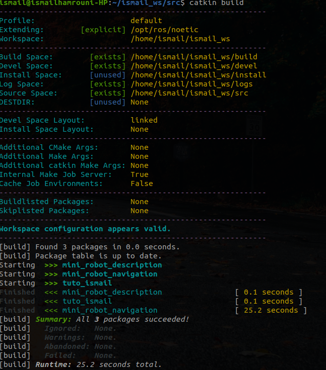

# Mini robot

## Description

This repository contain all necessary packages that are tested on a small robot simulation

## Requirements

### ROS Dependencies

```bash
sudo apt install ros-noetic-amcl
sudo apt install ros-noetic-map-server
sudo apt install ros-noetic-move-base
sudo apt-get install ros-noetic-teleop-twist-keyboard
```

### Others Dependencies

In this workspace, we are using the catkin tool to build all ROS packages.

```bash
sudo sh \
    -c 'echo "deb http://packages.ros.org/ros/ubuntu `lsb_release -sc` main" \
        > /etc/apt/sources.list.d/ros-latest.list'
wget http://packages.ros.org/ros.key -O - | sudo apt-key add -

sudo apt-get update
sudo apt-get install python3-catkin-tools
```

## Installation

Clone the project inside your ROS workspace : 

```bash
cd ~/catkin_ws/src
# clone with ssh if you have set up your ssh key
git clone git@github.com:ismailEngineer/mini_robot.git
# Otherwise you can clone through http
git clone https://github.com/ismailEngineer/mini_robot.git
```

Build the new packages :

```bash
cd ~/catkin_ws/
catkin build 
```



## Launch Gazebo

```bash
roslaunch mini_robot_description gazebo.launch
```

## Launch Navigation

```bash
roslaunch mini_robot_navigation navigation.launch
```